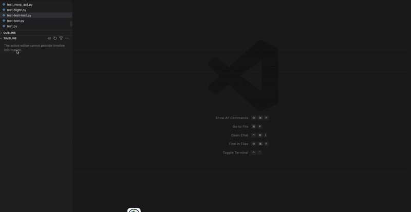
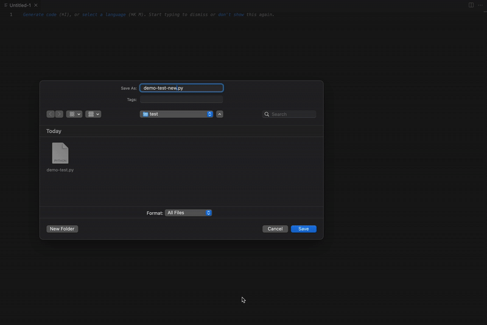

# Python Facts and Teacher

A fun VS Code extension that displays interesting Python facts when you open or create Python files! Learn something new about Python every time you code.


## ✨ See It In Action

### 🎯 Opening Python Files

<p align="center">
  
  <br/>
  <em>Get a fun Python fact every time you open or create a Python file!</em>
</p>

### 💾 Saving Python Files

<p align="center">
  
  <br/>
  <em>Learn something new about Python with every interaction.</em>
</p>

## Features

- **Automatic Fun Facts**: Shows a random Python fun fact whenever you open or create a `.py` file
- **Interactive Learning**: Click "Show More" to see detailed explanations, code examples, and helpful links
- **Rich Webview**: Beautiful, themed webview with syntax-highlighted code examples
- **Smart Rotation**: Tracks shown facts to avoid repetition in the same session
- **Manual Trigger**: Use the command palette to show facts anytime

## How It Works

1. **Open any Python file** - A notification will appear with a fun fact
2. **Create a new Python file** - Get a fact to inspire your coding session
3. **Click "Show More"** - Opens a detailed webview with:
   - Full explanation of the concept
   - Code examples you can try
   - Links to official documentation and tutorials
4. **Click "Dismiss"** - Simply close the notification

## 📖 Sample Facts Include

### 📚 Fact Categories

**Language Origins & History:**

- Python started as a Christmas holiday project in 1989
- Named after Monty Python's Flying Circus, not the snake
- Python is older than Java (1991 vs 1995)
- Python overtook French in primary school popularity

**Language Features:**

- The Zen of Python and its 19 guiding principles
- Duck typing: "If it walks like a duck and quacks like a duck..."
- List comprehensions and their performance benefits
- The powerful slice operator for elegant data manipulation
- F-strings: the fastest way to format strings
- Walrus operator (:=) for assignment expressions
- Match statements for structural pattern matching

**Advanced Concepts:**

- Everything is an object in Python
- The Global Interpreter Lock (GIL) and its implications
- Generators for memory-efficient iteration
- Decorators for extending function behavior
- Context managers and the 'with' statement
- Async/await for concurrent programming

**Hidden Gems & Easter Eggs:**

- Underscore (\_) remembers the last expression result
- Python can define infinity with float('inf')
- Hidden easter eggs like `import antigravity` and `import __hello__`
- The braces joke: `from __future__ import braces` (SyntaxError: not a chance)
- Hash of infinity returns 314159 (10^5 × π)
- Unicode variable names support (🐍 = 'Python' works!)
- The this.py module paradox (ugly code teaching beauty)
- FLUFL diamond operator (<>) from April Fools' PEP 401
- Chained comparisons like `1 < x < 10`
- Else clauses with loops
- Multiple implementations: CPython, Jython, PyPy

**Modern Python:**

- Dataclasses for simplified class creation
- Pathlib for modern path handling
- Type hints for better code documentation
- Collections module for specialized data types
- Itertools for powerful iterator operations

## 🤝 Contributing New Facts

Want to add more Python facts? We'd love your contributions!

📖 **See our [Contributing Guide](CONTRIBUTING.md)** for detailed instructions on how to add new facts.

🚀 **Quick Start**: Copy `fact-template.json`, fill it out, and place it in `src/facts/`

We're looking for facts about:

- Modern Python features and syntax
- Performance tips and best practices
- Hidden gems and easter eggs
- Python history and trivia
- Standard library highlights
- Common misconceptions clarified

## Commands

- `Python Facts and Teacher: Show Python Fun Fact` - Manually trigger a fun fact

## Requirements

- VS Code 1.104.0 or higher
- No additional dependencies required

## 🚀 Installation

### From VS Code Marketplace

1. Open VS Code
2. Go to Extensions (Ctrl+Shift+X)
3. Search for "Python Facts and Teacher"
4. Click Install

### Manual Installation

1. Download the `.vsix` file from [GitHub Releases](https://github.com/bhaumikmistry/python-facts-and-teacher/releases)
2. Open VS Code
3. Run `Extensions: Install from VSIX...` command
4. Select the downloaded file

### Get Started

1. Open or create any Python file
2. Enjoy learning new Python facts!
3. Use `Ctrl+Shift+P` → "Show Python Fun Fact" for manual triggers

## 🔧 Development & Building

### Prerequisites

- Node.js 16+ and npm
- VS Code 1.104.0+

### Setup

```bash
# Clone the repository
git clone https://github.com/bhaumikmistry/python-facts-and-teacher.git
cd python-facts-and-teacher

# Install dependencies
npm install

# Compile the extension
npm run compile
```

### Available Scripts

```bash
# Development
npm run compile          # Compile TypeScript
npm run watch           # Watch for changes
npm run lint            # Run ESLint

# Testing
npm run test            # Run tests
npm run compile-tests   # Compile test files

# Packaging
npm run build:vsix      # Build VSIX package
npm run vsce:package    # Create VSIX in root directory
npm run release         # Create VSIX in releases/ directory
npm run vsce:publish    # Publish to marketplace (requires auth)
```

### Creating VSIX Package

```bash
# Quick build
npm run build:vsix

# Build for release (outputs to releases/ directory)
npm run release
```

The VSIX file can be installed manually or distributed independently of the marketplace.

## Contributing

Found an interesting Python fact to add? Have suggestions for improvements? Feel free to contribute!

---

## 📊 Stats & Info


## 🔗 Resources

- **📖 [Contributing Guide](https://github.com/bhaumikmistry/python-facts-and-teacher/blob/main/CONTRIBUTING.md)** - How to add new facts
- **🐛 [Report Issues](https://github.com/bhaumikmistry/python-facts-and-teacher/issues)** - Bug reports and feature requests
- **💬 [Discussions](https://github.com/bhaumikmistry/python-facts-and-teacher/discussions)** - Community Q&A
- **⭐ [GitHub Repository](https://github.com/bhaumikmistry/python-facts-and-teacher)** - Source code and documentation
- **📝 [Changelog](https://github.com/bhaumikmistry/python-facts-and-teacher/blob/main/CHANGELOG.md)** - Version history
- **🎥 [Demo Videos](https://github.com/bhaumikmistry/python-facts-and-teacher/tree/main/resources)** - See all GIFs and screenshots

## Support

If you find this extension helpful:

- ⭐ **Star the repository** on GitHub
- 📝 **Leave a review** in the VS Code marketplace
- 🐛 **Report bugs** or suggest features via GitHub issues
- 🤝 **Contribute** new Python facts following our guide

---

**Happy Python coding! 🐍**
